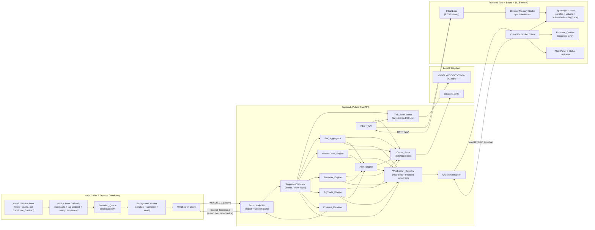
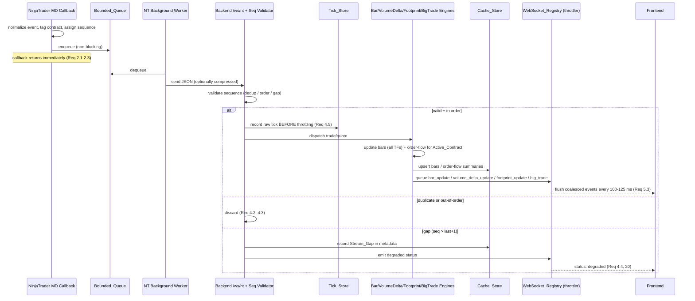
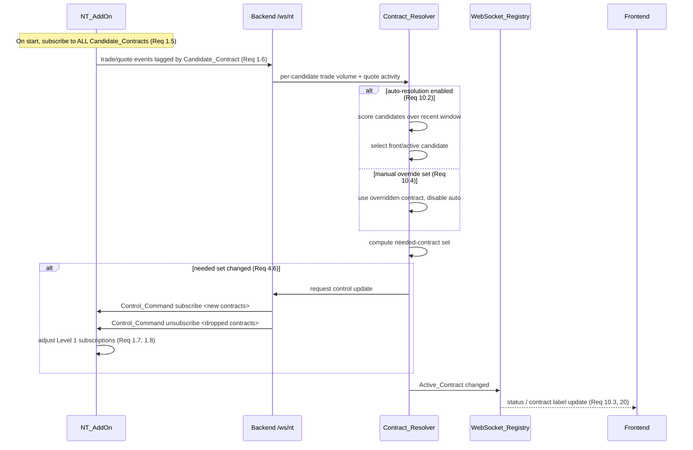
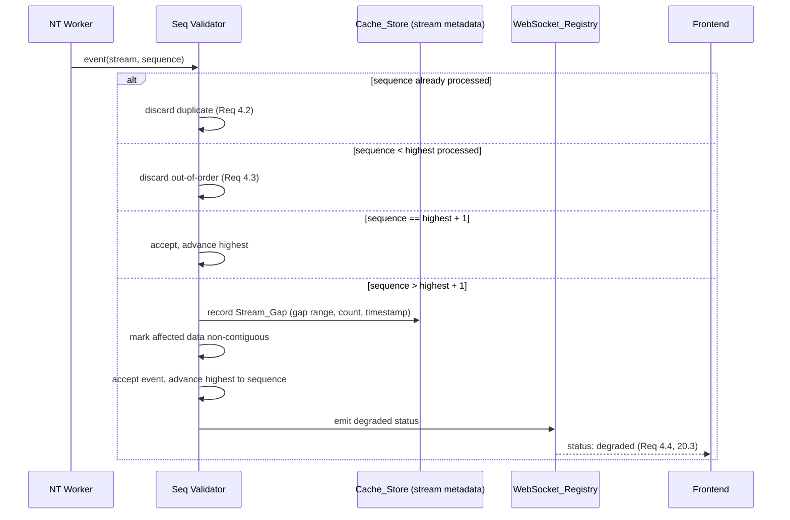

# Design Document

## Overview

This document describes the design for a local, Windows-first, TradingView-like charting platform for the GC (Gold) futures contract. The system is a three-tier pipeline that captures live Level 1 trade and quote data from NinjaTrader 8 / Rithmic, normalizes and forwards it to a Python backend, derives bars and order-flow indicators, persists raw and derived data to SQLite, and renders interactive charts in a React web frontend.

The three tiers are:

1. **NT_AddOn** — a NinjaTrader 8 C# AddOn that subscribes to Level 1 trade and quote feeds for all configured Candidate_Contracts, normalizes each event, tags it with its originating contract, assigns a monotonic per-stream sequence, buffers events in a Bounded_Queue, and forwards them to the Backend over a WebSocket client connection to `ws://127.0.0.1:<port>/ws/nt`. (Requirements 1, 2, 3)
2. **Backend** — a Python FastAPI service that ingests the NT stream, validates sequences, records every raw tick, persists raw data to a day-sharded Tick_Store and derived data to the Cache_Store, computes bars and order-flow indicators (VolumeDelta, Footprint, BigTrade), evaluates alerts, resolves the active GC contract, drives the NT_AddOn control plane, and streams throttled updates to the Frontend over `ws://127.0.0.1:<port>/ws/chart`. (Requirements 4–18, 20)
3. **Frontend** — a Vite + React + TypeScript application that renders candles and volume with TradingView Lightweight Charts, renders the footprint on a dedicated canvas layer, displays MVP indicators (VolumeDelta, BigTrade), manages alerts, and shows connection status. (Requirements 11, 12, 19, 20)

Design goals, in priority order, match the requirements: deliver the core chart first, then order-flow indicators (BigTrade, Footprint, VolumeDelta), then alerts. The MVP is **read-only** (no order entry, no broker execution, no DOM heatmap). All components run all-in-one on Windows for the MVP, but the Backend and Frontend tiers are kept cross-platform so a later phase can split them onto Linux. The Backend↔Frontend boundary is the only network surface intended to eventually cross hosts; the NT_AddOn↔Backend link is loopback-only in v1.

### Key Design Decisions

| Decision | Rationale |
| --- | --- |
| NT_AddOn is a **WebSocket client**, Backend is the **server** on `/ws/nt` | Lets the Backend own the listening socket and drive the control plane (subscribe/unsubscribe), and keeps NT reconnect logic simple. (Req 1.4, 4.6) |
| Callback path does **normalize + enqueue only** | Guarantees NinjaTrader UI/Dispatcher threads are never blocked by IO or serialization. (Req 2.1–2.3) |
| **Canonical_Timestamp = integer ms since Unix epoch UTC** | A single, lossless, comparable time key for merging, ordering, and parity with reference indicators. (Glossary, Req 13.8, 14.9, 15.2, 15.6) |
| Raw ticks in **day-sharded per-contract SQLite**, derived data in **single Cache_Store** | Keeps the hot read path (precomputed bars) small and fast while raw data is durably partitioned for rebuild/audit/retention. (Req 7, 8) |
| Bars and order-flow keyed by **(symbol, contract, timeframe, time)** | Uniform addressing across all derived data and a natural primary key for upserts and range queries. (Req 8.2) |
| Backend computes all order-flow and alerts **server-side** | The Frontend stays a thin renderer; parity with reference NT indicators is controlled in one place. (Req 13–17) |
| Frontend uses **incremental series updates** + **browser memory cache** | Meets the <300ms timeframe-switch and no-full-repaint requirements. (Req 11.3, 12) |
| **No synthetic continuous contract** in v1 | Explicitly out of scope; Contract_Resolver only selects among real candidate contracts. (Req 10.5) |

### Research Notes

- **NinjaTrader 8 AddOn threading**: NinjaTrader delivers market data on its internal threads; AddOns must not perform blocking IO on the data callback or the Dispatcher. The standard safe pattern is a producer/consumer split: the callback produces normalized records into a concurrent bounded queue, and a dedicated worker thread consumes, serializes, and transmits. This directly informs the Bounded_Queue + background worker design. (Req 2)
- **TradingView Lightweight Charts**: provides candlestick and histogram series with an incremental `update()` API for the most recent bar and `setData()` for bulk loads. It does not render arbitrary per-price-level cells, so the footprint must be drawn on a separate overlaid `<canvas>` synchronized to the chart's time and price scales. This informs the Footprint_Canvas-as-separate-layer decision. (Req 14.6, 19.4)
- **SQLite WAL mode**: WAL allows concurrent readers with a single writer and improves write throughput for the append-heavy tick workload, at the cost of a `-wal`/`-shm` sidecar file per database. Day-sharding bounds the size of any single tick file and makes 90-day retention a file-delete operation rather than a `DELETE` + `VACUUM`. (Req 7.3, 7.4, 7.5)
- **Order-flow classification**: bid/ask "lean" classification (trade at/above ask = buy, at/below bid = sell) is the standard approach used by the reference indicators. The uptick/downtick fallback and last-side reuse handle trades that print between or outside the snapshot bid/ask, which is necessary for deterministic parity. (Req 13.2–13.5)

## Architecture

### High-Level Component and Deployment Diagram



### Sequence Diagram: Live Tick Ingestion → Bars / Order-Flow → Frontend Streaming

This covers the hot path from a NinjaTrader trade event to a throttled Frontend update. (Requirements 1, 2, 4.5, 5.3, 9.2, 9.3, 13, 14, 15)



### Sequence Diagram: Contract Auto-Resolution and Control-Plane Subscribe/Unsubscribe

This covers how the Contract_Resolver selects the Active_Contract and how the needed-contract set drives Control_Commands. (Requirements 1.5–1.8, 4.6, 10)



### Sequence Diagram: Sequence-Gap Handling

This isolates the gap-detection branch of ingestion. (Requirements 4.2, 4.3, 4.4, 20.3)



### Concurrency Model

- **NT_AddOn**: two logical threads of control. The NinjaTrader market-data callback (producer) only normalizes and enqueues. A single background worker (consumer) owns serialization, optional compression, the WebSocket connection, and the reconnect loop. The Bounded_Queue is the only shared structure and is concurrency-safe. The control-plane receive loop (handling Control_Commands from the Backend) runs on the worker connection.
- **Backend**: built on FastAPI/`asyncio`. The `/ws/nt` ingestion path runs as an async task that reads frames, validates sequences synchronously (cheap, CPU-bound, no `await` mid-event), and dispatches to engines. Tick_Store and Cache_Store writes run via a dedicated writer abstraction (a single writer per database to respect SQLite's single-writer model; WAL allows concurrent readers from REST handlers). The WebSocket_Registry runs a periodic flush task (100–125ms) and a heartbeat task (30s ping). REST handlers are independent async endpoints reading from the Cache_Store/Tick_Store.
- **Frontend**: single-threaded event loop. The chart WebSocket client dispatches events to the chart series, the Footprint_Canvas redraw scheduler (throttled 100–125ms via `requestAnimationFrame` gating), and the alert/status UI.

## Components and Interfaces

### NT_AddOn (NinjaTrader 8 C# AddOn)

**Responsibility**: Subscribe to Level 1 trade and quote feeds for configured Candidate_Contracts, normalize and tag events, assign monotonic sequences, buffer in the Bounded_Queue, and forward to the Backend. Handle Control_Commands and emit connection status. (Requirements 1, 2, 3)

**Key internal interfaces (conceptual, C#):**

```csharp
// Producer side — runs on NinjaTrader market-data thread. Normalize + enqueue ONLY. (Req 2.1-2.3)
void OnMarketData(MarketDataEventArgs e);          // builds NormalizedEvent, calls queue.Enqueue
void OnMarketDepthOrQuote(...);                    // quote normalization

// Bounded_Queue — fixed capacity, thread-safe. (Req 2.4-2.6)
bool Enqueue(NormalizedEvent ev);                  // trade: drop-oldest-with-log if critically full;
                                                   // quote: coalesce-latest if full (Req 2.5)
NormalizedEvent Dequeue();                          // blocking/await for worker

// Background worker — serialization, compression, IO, reconnect. (Req 2.2, 3)
Task RunSenderLoopAsync(CancellationToken ct);     // dequeue -> serialize -> (compress) -> send
Task RunReconnectLoopAsync(CancellationToken ct);  // Fibonacci backoff + jitter, cap 60s (Req 3.1-3.3)
void OnControlCommand(ControlCommand cmd);          // subscribe/unsubscribe candidate (Req 1.7, 1.8)
event Action<ConnectionStatus> StatusChanged;       // connected/degraded/disconnected (Req 3.4, 20)

// Sequence assignment — monotonic per stream. (Req 1.3)
long NextSequence(string streamId);
```

**Configuration**: candidate contract list, Backend host/port, queue capacity, critical-overload threshold, compression on/off, optional manual contract override.

**Stream identity**: a **Stream** is identified by the tuple `(symbol, contract, channel)` where `channel ∈ {trade, quote}` (Glossary: Stream). Sequences are monotonic within a Stream and independent across Streams. (Req 1.3; Glossary: Sequence, Stream, Stream_Gap)

### Backend Components

#### `/ws/nt` Ingestion Endpoint + Sequence Validator

**Responsibility**: Accept the NT_AddOn connection, receive normalized trade/quote messages, and validate sequences. Sequences are scoped per **Stream**, where a Stream is the tuple `(symbol, contract, channel)` with `channel ∈ {trade, quote}`; sequences are monotonic within a Stream and independent across Streams (matching the NT_AddOn assignment). Discard duplicates (sequence already processed) and out-of-order events (sequence < highest). Detect Stream_Gap when sequence > highest + 1: log it, write to stream metadata, emit degraded status, mark affected data non-contiguous. Record every trade tick to the Tick_Store before throttling. (Requirements 1.3, 4.1–4.6)

```python
class SequenceValidator:
    def evaluate(self, stream_id: str, sequence: int) -> SeqDecision: ...
    # returns ACCEPT | DUPLICATE | OUT_OF_ORDER | GAP(gap_from, gap_to)

class IngestEndpoint:
    async def on_message(self, raw: bytes) -> None: ...
    async def send_control(self, cmd: ControlCommand) -> None: ...  # to NT_AddOn (Req 4.6)
    async def status_timeout_loop(self) -> None: ...  # half-open detection: 15s no data/status/heartbeat (Req 4.7, 4.8)
    def note_activity(self, now_ms: int) -> None: ...  # called on every received data/status/heartbeat frame (Req 4.7)
```

**NT half-open detection (Req 4.7, 4.8)**: the endpoint applies a heartbeat/status-timeout watchdog to the `/ws/nt` connection. Every received data message, status event, or heartbeat from the NT_AddOn refreshes a `last_seen` timestamp (Req 4.7). A watchdog task checks `last_seen`; if no data, status, or heartbeat is received within **15 seconds**, the Backend treats the connection as **disconnected**, emits a `disconnected` status event to subscribed Frontend clients, and releases the connection resources for that socket (Req 4.8). This detects a half-open TCP connection where NinjaTrader has silently died but the socket has not been torn down.

`SeqDecision` outcomes:
- `DUPLICATE` → discard (Req 4.2)
- `OUT_OF_ORDER` → discard (Req 4.3)
- `ACCEPT` (sequence == highest + 1, or first event) → process
- `GAP` (sequence > highest + 1) → record Stream_Gap, emit degraded, accept event and advance highest (Req 4.4)

#### Tick_Store Writer

**Responsibility**: Persist raw trades and quotes to per-contract, day-sharded SQLite files; create shards on demand; enforce 90-day retention by deleting expired shard files. (Requirements 7)

```python
class TickStore:
    def record_trade(self, t: NormalizedTrade) -> None: ...
    def record_quote(self, q: NormalizedQuote) -> None: ...
    def shard_path(self, contract: str, day: date) -> Path:  # data/ticks/GC/<contract>/YYYY-MM-DD.sqlite
        ...
    def purge_expired(self, now: datetime, retention_days: int = 90) -> list[Path]: ...  # Req 7.4, 7.5
    def read_range(self, contract: str, frm: int, to: int) -> Iterable[NormalizedTrade]: ...  # rebuild source (Req 8.5)
```

#### Bar_Aggregator

**Responsibility**: Aggregate Active_Contract trade ticks into OHLCV bars for 1m, 3m, 5m, 15m, 30m, 1h, 4h, 1D. Update the current bar per timeframe on each tick and emit bar_update. (Requirements 9)

```python
SUPPORTED_TFS = ["1m", "3m", "5m", "15m", "30m", "1h", "4h", "1D"]

class BarAggregator:
    def on_trade(self, t: NormalizedTrade) -> list[BarUpdate]: ...  # one per TF affected
    def bucket_start(self, ts_ms: int, tf: str) -> int: ...          # floor to TF boundary (UTC; 1D = UTC calendar day)
    def current_bar(self, contract: str, tf: str) -> Bar | None: ...
```

Bucket boundaries are computed from Canonical_Timestamp (ms since epoch, UTC). Intraday timeframes floor to multiples of their minute length; the 1D bar floors to the **UTC calendar day** in v1. A configurable session/timezone template (e.g. exchange-session or local-timezone daily boundaries) is **out of scope for v1** and documented as a future option; v1 always uses the UTC calendar day for the daily boundary. (Req 9.4, 9.5)

#### VolumeDelta_Engine

**Responsibility**: Compute per-bar volume, buyVolume, sellVolume, delta, deltaHigh, deltaLow, openDelta, closeDelta; classify trades using bid/ask lean with uptick/downtick fallback and last-side reuse; support Delta and CumulativeDelta modes; emit volume_delta_update. (Requirements 13)

```python
class VolumeDeltaEngine:
    def classify(self, trade_price, bid, ask, last_side, prev_price) -> Side: ...  # Req 13.2-13.5
    def on_trade(self, t: NormalizedTrade) -> VolumeDeltaUpdate: ...
    # config: min_trade_size=0 (Req 13.6), mode=Delta|CumulativeDelta (Req 13.6, 13.7)
```

#### Footprint_Engine

**Responsibility**: Compute M1 bid-by-ask ladder per price level and per-bar metrics POC, bar delta, buy %, sell %, imbalance, stacked imbalance, unfinished auction; emit footprint_update. (Requirements 14)

```python
class FootprintEngine:
    def on_trade(self, t: NormalizedTrade) -> FootprintUpdate: ...
    def ladder(self, contract: str, bar_time: int) -> dict[int, LadderCell]: ...  # price_level -> {bid, ask}
    def metrics(self, bar_time: int) -> FootprintMetrics: ...
    # config: GroupTicksPerLevel=0, DeltaCalculationMode=BidAsk,
    #         ImbalancePercent=100, ImbalanceMinVolume=10, TradeVolumeFilter=0 (Req 14.5)
```

#### BigTrade_Engine

**Responsibility**: Reconstruct the tape in simple mode; merge trades sharing the same Canonical_Timestamp and same side into one entry; apply volume filter; emit big_trade when a reconstructed trade passes the filter. (Requirements 15)

```python
class BigTradeEngine:
    def on_trade(self, t: NormalizedTrade) -> BigTradeEvent | None: ...
    def merge_key(self, t: NormalizedTrade) -> tuple[int, Side]: ...  # (canonical_ts_ms, side) (Req 15.2)
    # config: volume_filter_enable=True, min_volume=30, max_volume=-1 (Req 15.3)
```

#### Contract_Resolver

**Responsibility**: Select the Active_Contract from candidates using recent per-candidate trade volume + quote activity (when auto enabled); honor manual override (disabling auto); never build a synthetic continuous contract; compute the needed-contract set that drives Control_Commands. (Requirements 10, 4.6)

```python
class ContractResolver:
    def observe(self, contract: str, trade_volume: int, quote_events: int, ts_ms: int) -> None: ...
    def resolve(self) -> str: ...                # returns Active_Contract (Req 10.2)
    def set_manual_override(self, contract: str | None) -> None: ...  # Req 10.4
    def needed_contracts(self) -> set[str]: ...  # drives subscribe/unsubscribe (Req 4.6)
```

#### Alert_Engine

**Responsibility**: Evaluate enabled alerts server-side; emit and persist alert_event records; honor enable/disable. Supports: price crosses level, bar closes above level, bar closes below level, VolumeDelta threshold, BigTrade threshold, stacked imbalance appears. (Requirements 16, 17)

**Price source and evaluation timing**:
- `price_crosses_level` is evaluated against the **last trade price** of the Active_Contract. (Req 16.6)
- `bar_closes_above` / `bar_closes_below` are evaluated against the **close price of a closed bar** (evaluated only on bar close, never on an in-progress bar). (Req 16.7)

**Fire-once + re-arm semantics**:
- A `price_crosses_level` alert emits **at most one** `alert_event` per crossing event. After firing it is suppressed and **re-arms only after** the last trade price returns to the opposite side of the level. (Req 17.5, 17.7)
- A `bar_closes_above` / `bar_closes_below` alert emits **at most one** `alert_event` per bar-close event. After firing it is suppressed until a **subsequent bar closes**, at which point it re-arms for evaluation on that subsequent closed bar. (Req 17.6, 17.8)
- Each alert therefore carries an internal armed/fired state per alert so duplicate emissions for the same crossing or the same closed bar are impossible.

```python
class AlertEngine:
    def upsert(self, alert: Alert) -> Alert: ...
    def delete(self, alert_id: str) -> None: ...
    def set_enabled(self, alert_id: str, enabled: bool) -> None: ...   # Req 16.4
    def evaluate(self, ctx: MarketContext) -> list[AlertEvent]: ...     # Req 17.1, 17.2
```

#### WebSocket_Registry

**Responsibility**: Register Frontend clients on `/ws/chart`; manage per-client subscriptions; coalesce and flush updates every 100–125ms; send ping every 30s and close clients with no pong within 60s; isolate per-client broadcast failures. (Requirements 5, 6, 20)

```python
class WebSocketRegistry:
    async def register(self, client: ChartClient) -> None: ...
    async def subscribe(self, client_id: str, symbol: str, event_types: list[str]) -> None: ...  # Req 5.4
    async def unsubscribe(self, client_id: str, event_types: list[str]) -> None: ...             # Req 5.5
    def enqueue(self, event: OutboundEvent) -> None: ...    # coalesced by (type, symbol, key)
    async def flush_loop(self) -> None: ...                  # every 100-125 ms (Req 5.3)
    async def heartbeat_loop(self) -> None: ...              # ping 30s, drop after 60s no pong (Req 6.1, 6.3)
    async def broadcast(self, event: OutboundEvent) -> None: ...  # per-client try/except isolate (Req 6.4)
```

#### REST_API

**Responsibility**: Serve symbols, contracts, history, order-flow, big trades, and alert CRUD. Reads precomputed bars from the Cache_Store during normal use; rebuilds from the Tick_Store when required. (Requirements 8.3, 8.5, 11, 18) — see the REST API design section for full endpoint definitions.

### Frontend Modules

| Module | Responsibility | Requirements |
| --- | --- | --- |
| `ChartContainer` | Hosts Lightweight Charts; manages candle + volume series and incremental updates | 11.3, 19.1, 19.2 |
| `IndicatorLayer` | VolumeDelta and BigTrade series/markers on the Lightweight Charts instance | 13, 15.5, 19.2 |
| `FootprintCanvas` | Separate `<canvas>` layer; draws last 3 live M1 footprint bars; throttled redraw 100–125ms; redraw only on data/scale/layout change | 14.2, 14.6, 14.7, 14.8, 19.4 |
| `HistoryLoader` | Initial REST history fetch; populates browser memory cache | 11.1, 11.4 |
| `MemoryCache` | Per-timeframe in-browser bar cache for <300ms switches | 12.1, 12.2 |
| `RangePatcher` | Background fetch + patch for missing ranges; avoids full repaints | 12.3, 12.4 |
| `ChartSocket` | `/ws/chart` client; subscribe/unsubscribe; responds to ping with pong | 5.4, 5.5, 6.2, 11.2 |
| `CrosshairBox` | OHLCV readout following crosshair | 19.5 |
| `AlertPanel` | Alert lines + enable/disable/delete controls; toast + sound + event log | 16.5, 17.4 |
| `StatusIndicator` | connected / degraded / disconnected display | 20.3 |
| `Toolbar` / `TimeframeSelector` / `SymbolContractLabel` | TradingView-like layout chrome; shows `GC` + resolved contract (e.g. `GC 08-26`) | 10.1, 10.3, 19.1 |

### WebSocket Message Schemas

All messages are JSON objects with a `type` discriminator. Times are Canonical_Timestamp (integer ms since Unix epoch UTC) unless stated. Prices are numbers in contract price units; volumes are integers.

#### `/ws/nt` — NT_AddOn → Backend (data plane)

**Normalized trade message** (Req 1.1):

```json
{
  "type": "trade",
  "symbol": "GC",
  "contract": "GC 08-26",
  "time": 1730313600123,
  "price": 2345.6,
  "volume": 3,
  "bid": 2345.5,
  "ask": 2345.7,
  "bestBid": 2345.5,
  "bestAsk": 2345.7,
  "sequence": 105432
}
```

**Normalized quote message** (Req 1.2):

```json
{
  "type": "quote",
  "symbol": "GC",
  "contract": "GC 08-26",
  "time": 1730313600125,
  "bid": 2345.5,
  "ask": 2345.7,
  "bidSize": 12,
  "askSize": 9,
  "sequence": 105433
}
```

**Status event** (NT_AddOn → Backend) (Req 3.4, 20.1):

```json
{ "type": "status", "source": "nt_addon", "state": "connected", "time": 1730313600200 }
```

`state` ∈ `connected | degraded | disconnected`. `contract` MAY be included when status is contract-specific.

#### `/ws/nt` — Backend → NT_AddOn (control plane)

**Control_Command** (Req 1.7, 1.8, 4.6):

```json
{ "type": "control", "action": "subscribe", "contract": "GC 10-26", "time": 1730313600300 }
```

`action` ∈ `subscribe | unsubscribe`. One contract per command; the Backend sends multiple commands when several contracts change.

#### `/ws/chart` — Frontend ⇄ Backend

**Client → Backend: subscribe / unsubscribe** (Req 5.4, 5.5):

```json
{ "type": "subscribe", "symbol": "GC", "events": ["bar_update","quote_update","volume_delta_update","footprint_update","big_trade","alert_event","status"], "tf": "1m" }
```

```json
{ "type": "unsubscribe", "symbol": "GC", "events": ["footprint_update"] }
```

**Client → Backend: pong** (response to ping) (Req 6.2):

```json
{ "type": "pong", "time": 1730313600999 }
```

**Backend → Client: `bar_update`** (Req 5.2, 9.3):

```json
{
  "type": "bar_update",
  "symbol": "GC",
  "contract": "GC 08-26",
  "tf": "1m",
  "bar": { "time": 1730313600000, "open": 2345.1, "high": 2346.0, "low": 2344.8, "close": 2345.7, "volume": 142 },
  "closed": false
}
```

**Backend → Client: `quote_update`** (Req 5.2):

```json
{ "type": "quote_update", "symbol": "GC", "contract": "GC 08-26", "time": 1730313600125, "bid": 2345.5, "ask": 2345.7, "bidSize": 12, "askSize": 9 }
```

**Backend → Client: `volume_delta_update`** (Req 5.2, 13.1):

```json
{
  "type": "volume_delta_update",
  "symbol": "GC", "contract": "GC 08-26", "tf": "1m",
  "time": 1730313600000,
  "volume": 142, "buyVolume": 80, "sellVolume": 62,
  "delta": 18, "deltaHigh": 25, "deltaLow": -7,
  "openDelta": 0, "closeDelta": 18,
  "cumulativeDelta": 1234
}
```

`cumulativeDelta` is present only when CumulativeDelta mode is enabled (Req 13.7).

**Backend → Client: `footprint_update`** (Req 5.2, 14):

```json
{
  "type": "footprint_update",
  "symbol": "GC", "contract": "GC 08-26", "tf": "1m",
  "time": 1730313600000,
  "rows": [
    { "price": 2345.7, "bid": 5, "ask": 30, "imbalance": "ask" },
    { "price": 2345.6, "bid": 22, "ask": 18, "imbalance": null },
    { "price": 2345.5, "bid": 28, "ask": 3, "imbalance": "bid" }
  ],
  "poc": 2345.6,
  "barDelta": 18, "buyPct": 56.3, "sellPct": 43.7,
  "stackedImbalance": [ { "side": "bid", "from": 2345.3, "to": 2345.5 } ],
  "unfinishedAuction": { "high": false, "low": true }
}
```

**Backend → Client: `big_trade`** (Req 5.2, 15.4, 15.5):

```json
{
  "type": "big_trade",
  "symbol": "GC", "contract": "GC 08-26",
  "time": 1730313600123,
  "price": 2345.6,
  "volume": 65,
  "side": "buy"
}
```

**Backend → Client: `alert_event`** (Req 5.2, 17.2):

```json
{
  "type": "alert_event",
  "alertId": "a_2f1c",
  "alertType": "price_crosses_level",
  "symbol": "GC", "contract": "GC 08-26",
  "time": 1730313600500,
  "price": 2346.0,
  "message": "GC crossed 2346.0",
  "level": 2346.0
}
```

**Backend → Client: `status`** (Req 5.2, 20):

```json
{ "type": "status", "state": "degraded", "time": 1730313600600, "reason": "stream_gap", "contract": "GC 08-26" }
```

**Backend → Client: `ping`** (Req 5.2, 6.1):

```json
{ "type": "ping", "time": 1730313600000 }
```

## Data Models

### Canonical_Timestamp

All time values used for merging, ordering, bucketing, and parity are the **integer number of milliseconds since the Unix epoch in UTC** (`time` columns are `INTEGER`). This is lossless, directly comparable, and equivalent to ISO-8601 UTC at millisecond precision. The BigTrade merge key and all engine comparisons use this representation. (Glossary: Canonical_Timestamp; Req 13.8, 14.9, 15.2, 15.6)

### Tick_Store (per-contract, day-sharded SQLite)

Path: `data/ticks/GC/<contract>/YYYY-MM-DD.sqlite`, where `<contract>` is the originating Candidate_Contract identifier. WAL mode. Each shard contains a `ticks` table and a `quotes` table. (Requirements 7.1, 7.2, 7.3)

```sql
-- ticks: one row per recorded trade (Req 4.5, 7.2)
CREATE TABLE ticks (
    sequence   INTEGER NOT NULL,      -- per-stream monotonic sequence
    time       INTEGER NOT NULL,      -- Canonical_Timestamp (ms since epoch UTC)
    price      REAL    NOT NULL,
    volume     INTEGER NOT NULL,
    bid        REAL,
    ask        REAL,
    best_bid   REAL,
    best_ask   REAL,
    side       TEXT,                  -- classified side at record time (buy|sell|null)
    PRIMARY KEY (sequence)
);
CREATE INDEX idx_ticks_time ON ticks(time);

-- quotes: one row per recorded quote (Req 7.2)
CREATE TABLE quotes (
    sequence   INTEGER NOT NULL,
    time       INTEGER NOT NULL,      -- Canonical_Timestamp
    bid        REAL,
    ask        REAL,
    bid_size   INTEGER,
    ask_size   INTEGER,
    PRIMARY KEY (sequence)
);
CREATE INDEX idx_quotes_time ON quotes(time);
```

The `<contract>` directory name is filesystem-sanitized (e.g. `GC 08-26` → `GC_08-26`); the original contract identifier is preserved in Cache_Store metadata.

### Cache_Store (`data/app.sqlite`, single database, WAL)

Stores metadata, bars, order-flow summaries, footprint, alerts, and alert events. Bars and order-flow are keyed by `(symbol, contract, timeframe, time)`. Bars are retained indefinitely until deleted by a user. (Requirements 7.3, 8.1, 8.2, 8.4)

```sql
-- Stream + app metadata, including Stream_Gap records and Active_Contract state
CREATE TABLE metadata (
    key        TEXT PRIMARY KEY,      -- e.g. 'active_contract', 'auto_resolution', 'highest_seq:GC 08-26:trade'
    value      TEXT NOT NULL,
    updated_at INTEGER NOT NULL
);

CREATE TABLE stream_gaps (             -- Req 4.4
    id          INTEGER PRIMARY KEY AUTOINCREMENT,
    symbol      TEXT NOT NULL,
    contract    TEXT NOT NULL,
    channel     TEXT NOT NULL,         -- trade | quote
    gap_from    INTEGER NOT NULL,      -- last good sequence
    gap_to      INTEGER NOT NULL,      -- received sequence
    missing     INTEGER NOT NULL,      -- gap_to - gap_from - 1
    time        INTEGER NOT NULL       -- Canonical_Timestamp of detection
);

-- OHLCV bars (Req 8.2, 9.1)
CREATE TABLE bars (
    symbol    TEXT    NOT NULL,
    contract  TEXT    NOT NULL,
    timeframe TEXT    NOT NULL,        -- 1m,3m,5m,15m,30m,1h,4h,1D
    time      INTEGER NOT NULL,        -- bucket start, Canonical_Timestamp
    open      REAL    NOT NULL,
    high      REAL    NOT NULL,
    low       REAL    NOT NULL,
    close     REAL    NOT NULL,
    volume    INTEGER NOT NULL,
    closed    INTEGER NOT NULL DEFAULT 0,
    PRIMARY KEY (symbol, contract, timeframe, time)
);

-- Per-bar volume delta summary (Req 8.2, 13.1)
CREATE TABLE orderflow_volume_delta (
    symbol      TEXT NOT NULL,
    contract    TEXT NOT NULL,
    timeframe   TEXT NOT NULL,
    time        INTEGER NOT NULL,
    volume      INTEGER NOT NULL,
    buy_volume  INTEGER NOT NULL,
    sell_volume INTEGER NOT NULL,
    delta       INTEGER NOT NULL,
    delta_high  INTEGER NOT NULL,
    delta_low   INTEGER NOT NULL,
    open_delta  INTEGER NOT NULL,
    close_delta INTEGER NOT NULL,
    PRIMARY KEY (symbol, contract, timeframe, time)
);

-- Footprint bar header (M1) (Req 8.2, 14.4)
CREATE TABLE footprint_bars (
    symbol             TEXT NOT NULL,
    contract           TEXT NOT NULL,
    timeframe          TEXT NOT NULL DEFAULT '1m',
    time               INTEGER NOT NULL,
    poc                REAL,
    bar_delta          INTEGER NOT NULL,
    buy_pct            REAL NOT NULL,
    sell_pct           REAL NOT NULL,
    unfinished_high    INTEGER NOT NULL DEFAULT 0,
    unfinished_low     INTEGER NOT NULL DEFAULT 0,
    PRIMARY KEY (symbol, contract, timeframe, time)
);

-- Footprint ladder cells: one row per price level per bar (Req 14.3)
CREATE TABLE footprint_levels (
    symbol     TEXT NOT NULL,
    contract   TEXT NOT NULL,
    timeframe  TEXT NOT NULL DEFAULT '1m',
    time       INTEGER NOT NULL,       -- footprint bar time
    price      REAL NOT NULL,          -- price level (grouped per GroupTicksPerLevel)
    bid_volume INTEGER NOT NULL,       -- volume traded at bid (sell-side)
    ask_volume INTEGER NOT NULL,       -- volume traded at ask (buy-side)
    imbalance  TEXT,                   -- 'bid' | 'ask' | NULL
    PRIMARY KEY (symbol, contract, timeframe, time, price)
);

-- Big trades (Req 8.2, 15)
CREATE TABLE big_trades (
    symbol    TEXT NOT NULL,
    contract  TEXT NOT NULL,
    time      INTEGER NOT NULL,        -- Canonical_Timestamp (merge key)
    price     REAL NOT NULL,
    volume    INTEGER NOT NULL,        -- merged volume
    side      TEXT NOT NULL,           -- buy | sell
    PRIMARY KEY (symbol, contract, time, side)
);

-- Alerts (Req 16)
CREATE TABLE alerts (
    id         TEXT PRIMARY KEY,
    symbol     TEXT NOT NULL,
    type       TEXT NOT NULL,          -- price_crosses_level | bar_closes_above | bar_closes_below
                                       -- | volume_delta_threshold | big_trade_threshold | stacked_imbalance
    params     TEXT NOT NULL,          -- JSON: { "level": 2346.0, "threshold": 100, "tf": "1m", ... }
    enabled    INTEGER NOT NULL DEFAULT 1,
    created_at INTEGER NOT NULL,
    updated_at INTEGER NOT NULL
);

-- Alert events (audit log) (Req 17.3)
CREATE TABLE alert_events (
    id         INTEGER PRIMARY KEY AUTOINCREMENT,
    alert_id   TEXT NOT NULL,
    symbol     TEXT NOT NULL,
    contract   TEXT NOT NULL,
    time       INTEGER NOT NULL,
    price      REAL,
    message    TEXT NOT NULL,
    FOREIGN KEY (alert_id) REFERENCES alerts(id) ON DELETE CASCADE
);
CREATE INDEX idx_alert_events_alert ON alert_events(alert_id, time);
```

### In-Memory / Wire Models (Backend)

```python
@dataclass
class NormalizedTrade:
    symbol: str; contract: str; time: int      # Canonical_Timestamp ms
    price: float; volume: int
    bid: float | None; ask: float | None
    best_bid: float | None; best_ask: float | None
    sequence: int

@dataclass
class NormalizedQuote:
    symbol: str; contract: str; time: int
    bid: float; ask: float; bid_size: int; ask_size: int
    sequence: int

Side = Literal["buy", "sell"]
```

### Frontend Memory Cache Model

The browser memory cache holds, per `(symbol, contract, timeframe)`, an ordered array of bars plus the covered time range, enabling immediate render on timeframe switch and gap-aware background patching. (Req 12.1–12.3)

```ts
interface CachedSeries {
  symbol: string; contract: string; timeframe: string;
  bars: Bar[];               // sorted by time ascending
  coveredFrom: number; coveredTo: number;  // Canonical_Timestamp ms
}
```

## REST API Design

Base path `/api`. All times are Canonical_Timestamp (ms since epoch UTC). Successful responses are `200 OK` unless noted. Error responses use a consistent envelope. (Requirements 18, 11.4, 11.5)

### Error Response Envelope (Req 18.12)

```json
{ "error": { "code": "NOT_FOUND", "message": "Unknown timeframe '2m' for symbol 'GC'", "field": "tf" } }
```

| HTTP status | `code` | When |
| --- | --- | --- |
| 400 | `BAD_REQUEST` | malformed/missing query params or body |
| 404 | `NOT_FOUND` | unknown symbol, contract, timeframe, or alert id (Req 18.12) |
| 409 | `CONFLICT` | e.g. set active contract to a non-candidate |
| 422 | `VALIDATION_ERROR` | body fails schema validation |
| 500 | `INTERNAL` | unexpected server error |

### Endpoints

| Method | Path | Request | Success Response | Errors | Req |
| --- | --- | --- | --- | --- | --- |
| GET | `/api/symbols` | — | `{ "symbols": ["GC"] }` | 500 | 18.1 |
| GET | `/api/contracts?symbol=GC` | query `symbol` | `{ "symbol":"GC", "active":"GC 08-26", "candidates":[{"contract":"GC 08-26","autoSelected":true},{"contract":"GC 10-26"}] }` | 400, 404 | 18.2 |
| POST | `/api/contracts/active` | `{ "symbol":"GC", "contract":"GC 10-26" }` | `{ "symbol":"GC", "active":"GC 10-26", "autoResolution": false }` | 400, 404, 409 | 18.3, 10.4 |
| GET | `/api/history?symbol=GC&tf=1m&contract=&from=&to=&limit=` | query (`contract` optional) | `{ "symbol":"GC","contract":"GC 08-26","tf":"1m","bars":[{...}],"source":"cache" }` | 400, 404 | 18.4, 11.4, 11.5 |
| GET | `/api/orderflow/volume-delta?symbol=GC&tf=1m&contract=&from=&to=` | query (`contract` optional) | `{ "symbol":"GC","contract":"GC 08-26","tf":"1m","rows":[{ "time":..,"volume":..,"buyVolume":..,"sellVolume":..,"delta":..,"deltaHigh":..,"deltaLow":..,"openDelta":..,"closeDelta":.. }] }` | 400, 404 | 18.5 |
| GET | `/api/orderflow/footprint?symbol=GC&tf=1m&contract=&count=3` | query (`contract` optional) | `{ "symbol":"GC","contract":"GC 08-26","tf":"1m","bars":[{ "time":..,"rows":[...],"poc":..,"barDelta":..,"buyPct":..,"sellPct":..,"stackedImbalance":[...],"unfinishedAuction":{...} }] }` | 400, 404 | 18.6, 14.2 |
| GET | `/api/big-trades?symbol=GC&contract=&from=&to=` | query (`contract` optional) | `{ "symbol":"GC","contract":"GC 08-26","trades":[{ "time":..,"price":..,"volume":..,"side":".." }] }` | 400, 404 | 18.7 |
| GET | `/api/alerts` | — | `{ "alerts":[{ "id":..,"symbol":..,"type":..,"params":{...},"enabled":true }] }` | 500 | 18.8 |
| POST | `/api/alerts` | `{ "symbol":"GC","type":"price_crosses_level","params":{"level":2346.0} }` | `201` `{ "id":"a_2f1c", ...alert }` | 400, 422 | 18.9, 16.2 |
| PATCH | `/api/alerts/{id}` | `{ "enabled": false }` or editable fields e.g. `{ "params": { "level": 2350.0 } }` | `{ ...updated alert }` | 400, 404, 422 | 18.10, 16.4 |
| DELETE | `/api/alerts/{id}` | — | `204 No Content` | 404 | 18.11, 16.3 |

**Optional `contract` parameter**: `/api/history`, `/api/orderflow/volume-delta`, `/api/orderflow/footprint`, and `/api/big-trades` accept an OPTIONAL `contract=<contract>` query parameter selecting which GC contract to read. When the `contract` parameter is omitted, the Backend defaults it to the current Active_Contract resolved by the Contract_Resolver, and echoes the resolved `contract` in the response body so the Frontend knows which contract was served. A `contract` value that is not a known candidate returns `404 NOT_FOUND` with `field: "contract"`. (Req 18.4, 18.5, 18.6, 18.7)

**History semantics**: When the request hits the Cache_Store precomputed bars, the Backend returns the most recent 5,000 bars for the `(symbol, contract, timeframe)` within 1.5 seconds and sets `"source":"cache"` (Req 11.4). When a rebuild from the Tick_Store is required, the response sets `"source":"rebuild"` and carries no 1.5s latency guarantee (Req 11.5, 8.5).

**`limit`** defaults to and is capped at 5,000 for the cache path (Req 11.4). **`tf`** must be one of the supported timeframes or the endpoint returns `404 NOT_FOUND` with `field: "tf"`.

## Order-Flow Algorithms

> **Parity scope note.** The parity guarantees against the reference NinjaTrader indicators **MyVolumeDelta**, **MzFootprintClone**, and **BigTradeIndicator** hold **only for identical replay streams** — that is, the same ordered event stream including bid/ask snapshot state at each trade and the same Canonical_Timestamp precision (ms since epoch UTC). Parity is **not** asserted for live streams, where event ordering, snapshot timing, and dropped/coalesced quotes can differ between NinjaTrader's internal state and the Backend's reconstructed state. (Req 13.8, 14.9, 15.6)

### VolumeDelta Classification (Req 13.2–13.5)

For each trade, classify its volume as buy or sell using this ordered rule set, then accumulate per-bar metrics:

1. **Bid/ask lean (primary)**:
   - If `price >= ask` → **buy** (Req 13.2)
   - Else if `price <= bid` → **sell** (Req 13.3)
2. **Uptick/downtick fallback** (price strictly between bid and ask, or bid/ask unavailable) (Req 13.4):
   - If `price > prev_trade_price` → **buy**
   - Else if `price < prev_trade_price` → **sell**
3. **Last-side reuse** (no price change vs prior trade) → reuse the last classified side (Req 13.5).
   - At stream start with no prior side, the first ambiguous trade defaults to **buy** (documented tie-break; matches reference behavior under identical replay).

Per-bar accumulation (Req 13.1):
- `buyVolume += vol` if buy; `sellVolume += vol` if sell; `volume += vol`
- `delta = buyVolume - sellVolume`
- `deltaHigh = max(deltaHigh, running_delta)`, `deltaLow = min(deltaLow, running_delta)` tracked as the running delta evolves within the bar
- `openDelta` = running delta after the first classified trade of the bar; `closeDelta` = final delta of the bar
- Trades with `volume < min_trade_size` (default 0, so none excluded) are ignored (Req 13.6)
- CumulativeDelta mode adds the prior bar's closing cumulative value to each bar's delta progression (Req 13.7)

**Conservation invariant**: `buyVolume + sellVolume == volume` and `delta == buyVolume - sellVolume` for every bar.

### Footprint Ladder and Metrics (Req 14.3–14.5)

For each M1 bar, build a ladder keyed by price level (levels grouped per `GroupTicksPerLevel`; `0` = native tick granularity). For each trade in the bar, classify side (same rules as VolumeDelta) and add `volume` to the level's `ask_volume` (buy-side) or `bid_volume` (sell-side). DeltaCalculationMode = `BidAsk` (Req 14.5).

Per-bar metrics:
- **POC** (Point of Control): price level with maximum total volume (`bid_volume + ask_volume`); ties broken by highest total then highest price (documented deterministic tie-break).
- **bar delta** = `Σ ask_volume − Σ bid_volume` across levels.
- **buy % / sell %** = `Σ ask_volume / total`, `Σ bid_volume / total` (total > 0; both 0 when total == 0).
- **imbalance** (per level, diagonal): compare a level's `ask_volume` against the next-lower level's `bid_volume`. A side is imbalanced when it exceeds the opposing diagonal volume by `ImbalancePercent` (100%) **and** the dominant volume ≥ `ImbalanceMinVolume` (10). (Req 14.5)
- **stacked imbalance** (`Stacked_Imbalance`): ≥ 2 consecutive price levels imbalanced on the same side, matching the 2-or-more consecutive same-side imbalanced level threshold used by the reference MzFootprintClone indicator. (Req 14.10)
- **unfinished auction**: at the bar's extreme high (or low) level, both bid and ask volumes are non-zero (the extreme was not "finished" by one-sided trading).
- Trades with `volume < TradeVolumeFilter` (default 0) are excluded (Req 14.5).

**Ladder conservation invariant**: `Σ(bid_volume + ask_volume)` over all ladder levels == the footprint bar's total traded volume, and equals the corresponding M1 OHLCV bar volume for the same `(contract, time)`.

### BigTrade Reconstruction and Merge (Req 15.1–15.4)

Simple mode only — no iceberg detection, DOM pressure, or DOM support (Req 15.1).

1. Classify each trade's side (same classification rules).
2. **Merge**: trades sharing the **same Canonical_Timestamp and same side** are merged into a single reconstructed tape entry; merged `volume` is the sum, `price` is the last trade's price within the group. The merge key is `(canonical_ts_ms, side)`, applied after serialization to the canonical ms representation (Req 15.2).
3. **Filter**: with `VolumeFilterEnable = true`, emit a `big_trade` when merged `volume >= MinVolume` (30) and (`MaxVolume == -1` meaning no upper bound, else `volume <= MaxVolume`) (Req 15.3, 15.4).

**Merge determinism invariant**: merging is independent of the arrival order of trades that share the same `(timestamp, side)` group — the merged volume and resulting emit/no-emit decision are identical for any permutation within a group.

### Contract Resolution Scoring (Req 10.2)

Over a sliding recent window, each candidate accumulates a score from trade volume and quote activity (e.g. `score = w_v * trade_volume + w_q * quote_events`, default weights documented in config). The candidate with the maximum score is the Active_Contract; a documented deterministic tie-break (higher trade volume, then lexically-later contract code, which favors the nearer front month) resolves ties. A manual override pins the Active_Contract and disables auto-resolution (Req 10.4). The Backend never synthesizes a continuous contract (Req 10.5). The needed-contract set is `{ all candidates }` for observation plus the Active_Contract for charting; in v1 all candidates remain subscribed for resolution, and Control_Commands are emitted only when the candidate configuration changes (Req 4.6).

### Alert Evaluation Semantics (Req 16.6, 16.7, 17.5–17.8)

Alerts are evaluated server-side with explicit price sources, evaluation timing, and a fire-once + re-arm state machine so each event fires at most once.

- **Price source**:
  - `price_crosses_level` uses the **last trade price** of the Active_Contract. A crossing occurs when the level lies strictly between the previous observed last trade price and the current last trade price (a mere touch is not a crossing). (Req 16.6)
  - `bar_closes_above` / `bar_closes_below` use the **close price of a closed bar** and are evaluated only when a bar closes, never on an in-progress bar. (Req 16.7)
- **Fire-once per event**:
  - At most one `alert_event` is emitted per crossing event for `price_crosses_level`. (Req 17.5)
  - At most one `alert_event` is emitted per bar-close event for `bar_closes_above` / `bar_closes_below`. (Req 17.6)
- **Re-arm on reset** (each alert holds an `armed` flag):
  - A fired `price_crosses_level` alert stays suppressed and re-arms only after the last trade price returns to the **opposite side of the level** (the condition resets). (Req 17.7)
  - A fired `bar_closes_above` / `bar_closes_below` alert stays suppressed until a **subsequent bar closes**, at which point it re-arms and is evaluated on that newly closed bar. (Req 17.8)

This makes a fired alert idempotent for the duration of a single crossing or single closed-bar event: repeated evaluations against the same crossing/bar produce no additional `alert_event`s until the condition resets.

## Correctness Properties

*A property is a characteristic or behavior that should hold true across all valid executions of a system — essentially, a formal statement about what the system should do. Properties serve as the bridge between human-readable specifications and machine-verifiable correctness guarantees.*

This feature is well suited to property-based testing because its core consists of pure, input-varying logic: sequence validation, bar aggregation, order-flow classification and aggregation, footprint ladder construction, big-trade merging, throttling timing, contract resolution, and series-cache range math. These are validated below. UI rendering, layout, transport wiring, configuration defaults, and one-shot setup are covered by example/integration/smoke tests in the Testing Strategy and are intentionally excluded from the property set.

The properties below are the consolidated set after redundancy reflection (see Testing Strategy for the example/edge/integration/smoke complement).

### Property 1: Per-stream sequence assignment is strictly monotonic

*For any* series of normalized events emitted by the NT_AddOn on a given stream `(symbol, contract, channel)`, the assigned sequence values are strictly increasing in emission order, and sequences assigned on different streams are independent.

**Validates: Requirements 1.3**

### Property 2: Forwarded events are tagged with their originating contract

*For any* normalized event built from a given Candidate_Contract source, the `contract` field of the forwarded message equals that source contract.

**Validates: Requirements 1.6**

### Property 3: Bounded_Queue retains trades under threshold, coalesces quotes at capacity, and logs trade drops

*For any* sequence of enqueue operations: (a) while the queue is below the critical-overload threshold, every trade event is later dequeued (no trade lost); (b) when a quote arrives at capacity, the retained quote for that stream is the most recent one and superseded quotes are discarded; (c) every trade dropped due to critical overload has a corresponding log entry, so the dropped-trade log count equals the number of dropped trades.

**Validates: Requirements 2.4, 2.5, 2.6**

### Property 4: Reconnect backoff is Fibonacci-based, jittered within bounds, and capped at 60s

*For any* reconnect attempt index `n`, the base delay equals the `n`-th term of the Fibonacci backoff sequence (1s, 1s, 2s, 3s, 5s, 8s, …), the jittered delay lies within the documented jitter band around the base delay, and the final delay never exceeds 60,000 ms.

**Validates: Requirements 3.1, 3.2, 3.3**

### Property 5: Sequence validator deduplicates, drops out-of-order, and detects gaps

*For any* Stream — identified by the tuple `(symbol, contract, channel)` with `channel ∈ {trade, quote}` — and *any* arrival of events with arbitrary sequence values: an event whose sequence was already processed is discarded; an event whose sequence is below the highest processed sequence is discarded; an event whose sequence equals highest + 1 (or is the first event) is accepted and advances the highest; and an event whose sequence exceeds highest + 1 is accepted while recording exactly one Stream_Gap with `gap_from = previous highest`, `gap_to = received sequence`, `missing = gap_to - gap_from - 1`, and emitting a degraded status. Sequence state is tracked independently per Stream. In-order streams produce no gap records and no degraded status.

**Validates: Requirements 1.3, 4.2, 4.3, 4.4**

### Property 6: Every accepted trade is recorded before throttling

*For any* stream of accepted (non-duplicate, in-order) trade events, the number of trades persisted to the Tick_Store equals the number of accepted trades, independent of UI update throttling.

**Validates: Requirements 4.5**

### Property 7: Control_Commands equal the change in the needed-contract set

*For any* transition from an old needed-contract set to a new one, the Backend emits exactly one `subscribe` command per contract added and exactly one `unsubscribe` command per contract removed, and emits no commands when the set is unchanged.

**Validates: Requirements 4.6, 1.7, 1.8**

### Property 8: Clients receive only their subscribed event types (subscribe/unsubscribe round-trip)

*For any* set of clients with arbitrary subscription sets and *any* stream of outbound events, each client receives exactly the events whose type and symbol it is subscribed to; after a client unsubscribes from a type, it receives no further events of that type; re-subscribing restores delivery.

**Validates: Requirements 5.1, 5.4, 5.5**

### Property 9: UI streaming and footprint redraws are throttled within 100–125ms with coalescing

*For any* inbound event/redraw-request rate driven against a virtual clock, the spacing between consecutive flushes/redraws stays within the closed interval [100ms, 125ms] whenever work is pending, and multiple updates sharing the same coalescing key within one interval are collapsed into a single emitted update carrying the latest state.

**Validates: Requirements 5.3, 14.8**

### Property 10: Broadcast failures are isolated per client

*For any* set of connected clients in which an arbitrary subset raises an exception on send, every healthy client still receives the event, every failing client is removed from the registry, and no exception propagates out of the broadcast.

**Validates: Requirements 6.4**

### Property 11: Tick_Store shard path is a pure function of contract and UTC day

*For any* contract identifier and *any* Canonical_Timestamp, the resolved shard path equals `data/ticks/GC/<contract>/YYYY-MM-DD.sqlite` where `YYYY-MM-DD` is the UTC calendar day of the timestamp, and timestamps on opposite sides of a UTC midnight resolve to different shards.

**Validates: Requirements 7.1**

### Property 12: Shard retention keeps shards within 90 days and deletes older ones

*For any* set of shard files with arbitrary ages relative to a reference "now", the purge operation deletes exactly the shards older than 90 days and retains all shards 90 days old or newer.

**Validates: Requirements 7.4, 7.5**

### Property 13: Bars and order-flow upserts are keyed and last-write-wins

*For any* sequence of bar or order-flow upserts, at most one record exists per `(symbol, contract, timeframe, time)` key, and the stored record equals the most recent write for that key.

**Validates: Requirements 8.2**

### Property 14: OHLCV bars satisfy aggregation invariants and correct bucketization

*For any* trade tick stream and *any* supported timeframe, every produced bar satisfies `low <= min(open, close)`, `high >= max(open, close)`, `low <= high`, `volume == sum of constituent trade volumes`, `open == first trade price in the bucket`, `close == last trade price in the bucket`, and each bar's `time` equals the timeframe-floored bucket start of its constituent trades using UTC calendar boundaries (intraday timeframes floored to multiples of their interval; the 1D bar floored to the UTC calendar day).

**Validates: Requirements 9.1, 9.4, 9.5**

### Property 15: Coarser timeframes are consistent roll-ups of finer ones

*For any* trade tick stream, each coarser-timeframe bar equals the aggregation of the finer-timeframe bars spanning the same interval: open from the first finer bar, close from the last, high/low as the extremes, and volume as the sum (e.g., a 5m bar equals the roll-up of its five constituent 1m bars).

**Validates: Requirements 9.2**

### Property 16: VolumeDelta classification conforms to the ordered rule set

*For any* trade with a given `(price, bid, ask, prev_price, last_side)`, the classified side equals: buy if `price >= ask`; else sell if `price <= bid`; else (between spread or missing quote) buy if `price > prev_price` and sell if `price < prev_price`; else the last classified side.

**Validates: Requirements 13.2, 13.3, 13.4, 13.5**

### Property 17: VolumeDelta per-bar metrics are conserved (including cumulative mode)

*For any* classified trade stream, each bar satisfies `buyVolume + sellVolume == volume`, `delta == buyVolume - sellVolume`, `deltaLow <= openDelta <= deltaHigh`, `deltaLow <= closeDelta <= deltaHigh`, `closeDelta == delta`, and `deltaHigh`/`deltaLow` bound the running delta over the bar; in CumulativeDelta mode, the cumulative delta at bar `k` equals the sum of bar deltas for all bars up to and including `k`.

**Validates: Requirements 13.1, 13.7**

### Property 18: Footprint ladder is conserved and its metrics follow their definitions

*For any* set of trades within an M1 bar, the bid-by-ask ladder satisfies `Σ(bid_volume + ask_volume)` over all levels `== bar total volume == the matching 1m OHLCV bar volume`; the POC is the level of maximum total volume (documented tie-break); `bar delta == Σ ask_volume − Σ bid_volume`; `buy% + sell% == 100` when total volume > 0 (both 0 otherwise); a level is marked imbalanced only when its dominant side exceeds the opposing diagonal volume by `ImbalancePercent` and the dominant volume `>= ImbalanceMinVolume`; stacked imbalance requires `>= 2` consecutive same-side imbalanced levels (matching the reference MzFootprintClone threshold, per `Stacked_Imbalance`); and unfinished auction is flagged at an extreme level only when both its bid and ask volumes are non-zero.

**Validates: Requirements 14.3, 14.4, 14.10**

### Property 19: Footprint display selects exactly the last 3 M1 bars

*For any* stream of footprint bars, the display-selection function returns exactly the three most recent distinct M1 bars by time (or all bars when fewer than three exist), in time order.

**Validates: Requirements 14.2**

### Property 20: BigTrade merge is deterministic and the volume filter governs emission

*For any* set of trades, trades sharing the same Canonical_Timestamp and same side merge into a single entry whose volume is the sum and whose price is the last trade's price in the group; the merge result is invariant under any permutation of trades within a `(timestamp, side)` group; and a `big_trade` is emitted for a merged entry if and only if `VolumeFilterEnable` is true, `volume >= MinVolume`, and (`MaxVolume == -1` or `volume <= MaxVolume`).

**Validates: Requirements 15.2, 15.4**

### Property 21: Contract resolution selects a real candidate, honoring override

*For any* set of per-candidate activity (trade volume + quote activity): with auto-resolution enabled, `resolve()` returns the maximum-scoring candidate under the documented scoring and tie-break; with a manual override set, `resolve()` returns the override and auto-resolution is disabled regardless of scores; and in all cases the returned contract is a member of the candidate set (never a synthetic continuous contract).

**Validates: Requirements 10.2, 10.4, 10.5**

### Property 22: Incremental bar updates merge without full replacement

*For any* initial bar series and *any* sequence of `bar_update` events, applying the updates incrementally yields a series identical to the expected merge (new bars appended in time order, in-progress bars overwritten by time key), with no full-data-replacement operation performed.

**Validates: Requirements 11.3**

### Property 23: History cache returns the most recent bars up to the 5,000 cap

*For any* stored bar set for a `(symbol, contract, timeframe)` and *any* request, the cache-path response returns the most recent `min(N, min(limit, 5000))` bars in ascending time order with no duplicates or gaps relative to the stored data.

**Validates: Requirements 11.4**

### Property 24: Missing-range patching yields a contiguous, duplicate-free series

*For any* cached series coverage and *any* requested range, the computed missing sub-ranges are exactly the portions of the request not already covered; after fetching and patching, the resulting series is sorted by time, contains no duplicate bar times, and covers the union of the prior coverage and the request with no internal gaps.

**Validates: Requirements 12.3**

### Property 25: Alert CRUD round-trips through the Cache_Store

*For any* alert definition: creating it then reading it back returns equal fields; applying a PATCH with an arbitrary subset of editable fields (including `enabled`) updates exactly those fields and leaves the others unchanged; and deleting it makes subsequent reads report it absent.

**Validates: Requirements 16.2, 16.3, 18.10**

### Property 26: Alert evaluation respects enablement, condition semantics, price source, and fire-once + re-arm

*For any* alert and *any* market context: a disabled alert never emits an `alert_event`; an enabled alert emits an `alert_event` if and only if its condition semantics are met; and every emitted `alert_event` has a corresponding persisted alert-event record with matching fields. Condition semantics include: (a) `price_crosses_level` is evaluated against the **last trade price** and fires only when the price path actually crosses the level, i.e., the level lies strictly between consecutive observed last trade prices, not merely touches; (b) `bar_closes_above` / `bar_closes_below` are evaluated against the **close price of a closed bar** only; (c) each alert fires **at most once per event** — one crossing for `price_crosses_level`, one closed bar for the bar-close types; and (d) after firing, the alert **re-arms only after the condition resets** — for `price_crosses_level` when the last trade price returns to the opposite side of the level, and for the bar-close types only when a subsequent bar closes. While suppressed (fired and not yet re-armed), repeated evaluations against the same crossing or the same closed bar emit no further `alert_event`s.

**Validates: Requirements 16.4, 16.6, 16.7, 17.1, 17.2, 17.3, 17.5, 17.6, 17.7, 17.8**

### Property 27: Unknown identifiers produce a descriptive error response

*For any* request referencing a symbol, contract, timeframe, or alert id that does not exist, the REST_API returns the documented error envelope with an appropriate HTTP status (404 for unknown resources, 400 for malformed parameters) and identifies the offending field.

**Validates: Requirements 18.12**

### Property 28: VolumeDelta parity with MyVolumeDelta under identical replay

*For any* recorded replay stream (identical ordered events including bid/ask snapshot state and Canonical_Timestamp precision) with paired reference output, the VolumeDelta_Engine's per-bar output equals the reference MyVolumeDelta indicator's output for all bars, given the same configuration.

**Validates: Requirements 13.8**

### Property 29: Footprint parity with MzFootprintClone under identical replay

*For any* recorded replay stream (identical ordered events including bid/ask snapshot state and Canonical_Timestamp precision) with paired reference output, the Footprint_Engine's ladder rows, POC, and imbalance values equal the reference MzFootprintClone indicator's output for all footprint bars, given the same configuration.

**Validates: Requirements 14.9**

### Property 30: BigTrade parity with BigTradeIndicator under identical replay

*For any* recorded replay stream (identical ordered events including bid/ask snapshot state and Canonical_Timestamp precision) with paired reference output, the BigTrade_Engine's emitted markers equal the reference BigTradeIndicator's markers (with `MinVolume = 30`) for all trades in that stream.

**Validates: Requirements 15.6**

### Property 31: NT_AddOn connection times out as disconnected after 15s of silence

*For any* sequence of received frames (data, status, or heartbeat) on `/ws/nt` driven against a virtual clock, the connection is treated as disconnected exactly when the gap since the last received frame reaches 15 seconds: while frames arrive at most 15 seconds apart the connection stays live with no disconnected status emitted; once 15 seconds elapse with no data, status, or heartbeat, the Backend emits exactly one `disconnected` status event to subscribed Frontend clients and releases the connection resources for that socket. Any received frame before the timeout resets the watchdog.

**Validates: Requirements 4.7, 4.8**

## Error Handling

### NT_AddOn: Thread Safety, Backpressure, and Queue Overload (Req 2)

- **Callback isolation**: the market-data callback only normalizes and enqueues. It never performs IO, file access, or JSON serialization, so an exception in serialization or transport can never propagate onto NinjaTrader's UI/Dispatcher threads. (Req 2.1–2.3)
- **Bounded_Queue backpressure**: the queue has a fixed capacity. Trade events are retained while below the critical-overload threshold (Req 2.4). When a new quote arrives and the queue is at capacity, the newest quote supersedes the older buffered quote for that stream (quotes are last-value-wins) (Req 2.5). If the queue is critically overloaded and a trade must be dropped, the AddOn writes a log entry recording the dropped trade, including stream, sequence, and timestamp (Req 2.6).
- **Worker fault tolerance**: serialization/compression/send errors in the background worker are caught, logged, and trigger the reconnect path rather than crashing the worker. The worker drains and resumes from the queue on reconnect.

### NT_AddOn: Reconnect and Backoff (Req 3)

- On connection loss, the worker enters the reconnect loop using the Fibonacci backoff schedule (1s, 1s, 2s, 3s, 5s, 8s, …) with randomized jitter added to each delay, capped at 60s. (Req 3.1–3.3)
- Each connection state transition emits a status event (`connected`, `degraded`, `disconnected`) that the Backend forwards to Frontend clients. (Req 3.4, 20.1, 20.2)
- The reconnect loop is cancellation-aware so a clean shutdown does not leave a pending backoff timer.

### Backend: Sequence Gaps and Stream Integrity (Req 4)

- Duplicates and out-of-order events are discarded silently (no degraded status), as they are normal under at-least-once delivery. (Req 4.2, 4.3)
- A Stream_Gap (`sequence > highest + 1`) is logged, written to the `stream_gaps` table with the gap range and missing count, and triggers a `degraded` status event to subscribed clients. The affected derived data is marked non-contiguous so downstream consumers can flag it. The gapped event is still accepted and the highest sequence advances (we do not stall waiting for missing events that may never arrive). (Req 4.4)
- Stream metadata (`highest_seq:<contract>:<channel>`) is kept in the `metadata` table to survive restarts where appropriate.

### Backend: NT_AddOn Connection Liveness / Half-Open Detection (Req 4.7, 4.8)

- The `/ws/nt` ingestion endpoint applies a **heartbeat/status-timeout watchdog** to the NT_AddOn connection. Every received data message, status event, or heartbeat from the NT_AddOn refreshes a `last_seen` timestamp. (Req 4.7)
- If no data message, status event, or heartbeat is received within **15 seconds**, the Backend treats the NT_AddOn connection as **disconnected**: it emits a `disconnected` status event to subscribed Frontend clients (so the StatusIndicator reflects the loss) and releases the connection resources for that socket (closes the server-side socket and clears per-connection state). (Req 4.8)
- This is the NT-side complement to the Frontend-side heartbeat (Req 6): the Frontend heartbeat (ping/pong, 30s/60s) detects dead browser clients on `/ws/chart`, while this watchdog detects a half-open `/ws/nt` connection where NinjaTrader has silently died but the TCP socket has not been torn down. Both exist independently.
- On the next successful NT_AddOn reconnect (its Fibonacci backoff loop, Req 3), the endpoint accepts a fresh connection and resumes ingestion; the watchdog timer restarts on the first received frame.

### Backend: WebSocket Heartbeat and Dead-Client Cleanup (Req 5, 6)

- The WebSocket_Registry pings each client every 30s (Req 6.1). A client that does not return a pong within 60s is closed and removed (Req 6.3).
- Broadcasts are wrapped per client in try/except: an exception while sending to one client removes that client and continues broadcasting to the rest; the failure never aborts the broadcast or affects other clients. (Req 6.4)
- Backpressure to the Frontend is bounded by the 100–125ms coalescing flush: only the latest state per `(type, symbol, key)` is sent each interval, so a slow burst of updates cannot unboundedly grow per-client send buffers. (Req 5.3)

### Backend: REST Error Responses (Req 18.12)

- All endpoints return the standard error envelope `{ "error": { "code", "message", "field?" } }`.
- Unknown symbol/contract/timeframe/alert id → `404 NOT_FOUND` with the offending `field`. Malformed or missing query parameters → `400 BAD_REQUEST`. Body schema violations → `422 VALIDATION_ERROR`. Setting a non-candidate active contract → `409 CONFLICT`. Unexpected errors → `500 INTERNAL` (logged with a correlation id, no internal details leaked to the client).

### Backend: SQLite / WAL Failure Handling (Req 7.3, 8.1)

- Both databases open in WAL mode. A single writer per database serializes writes (matching SQLite's single-writer model); REST readers use WAL's concurrent-read capability.
- `SQLITE_BUSY`/lock contention is handled with a bounded retry-with-timeout (busy_timeout) and then surfaced as a logged error; ingestion writes that fail are retried on the next event rather than dropping the in-memory aggregate state.
- On startup, a WAL checkpoint and integrity check (`PRAGMA quick_check`) run; a corrupt Cache_Store can be rebuilt from the Tick_Store, while a corrupt tick shard is quarantined (renamed) and a gap is logged so the rest of the system keeps running.
- Disk-full and IO errors are caught at the writer boundary, logged, and surfaced as a `degraded` status; the system continues serving cached reads.

### Backend: Shard Retention and Cleanup (Req 7.4, 7.5)

- A scheduled retention job deletes tick shard files older than 90 days (whole-file delete, no row-level `DELETE`/`VACUUM`). Deletion is idempotent and logs each removed shard. A shard currently being written (today's shard) is never eligible for deletion.

### Frontend: Connection and Load Errors

- A failed initial REST history load surfaces a non-blocking error and retries; the chart shows an empty state until data arrives. (Req 11)
- The chart WebSocket client reconnects on drop and re-subscribes; while disconnected, the StatusIndicator shows `disconnected` and live updates pause without discarding cached bars. (Req 20.3)
- **Regression note (2026-06-01): keep REST and chart WebSocket on the same origin in dev.** Vite proxies both `/api` and `/ws` to the backend; do not hard-code the browser's `/ws/chart` URL to `:8000` while REST uses same-origin `/api`. When multiple backend processes are listening (for example one on `127.0.0.1:8000` and another on `0.0.0.0:8000`), REST history can load from one runtime while live WebSocket updates connect to another, producing the symptom "refresh loads bars, but the chart does not update live." Use `ws(s)://<current-host>/ws/chart` from `window.location.host` so Vite/prod routing keeps REST and WS on the same backend.
- A `degraded` status (e.g., from a Stream_Gap) is shown distinctly from `disconnected` so the user knows data is flowing but may be non-contiguous. (Req 4.4, 20.3)

## Testing Strategy

### Dual Approach

The system is tested with complementary layers:

- **Property-based tests** verify the universal correctness properties above across many generated inputs. They are the primary guard for the sequence validator, bar aggregation, order-flow engines, big-trade merge, throttling, contract resolution, retention, series-cache math, and the three reference-indicator parity properties.
- **Example-based unit tests** cover specific behaviors, schema serialization of each event type, config defaults, and UI-adjacent logic.
- **Integration tests** cover transport wiring and external behavior that does not vary meaningfully with input.
- **Smoke tests** cover one-time setup and configuration.

Unit tests are deliberately kept lean where a property test already provides broad input coverage; they focus on concrete examples, integration points, and edge/error cases.

### Property-Based Testing

**Libraries** (do not implement PBT from scratch):
- **Backend (Python)**: [Hypothesis](https://hypothesis.readthedocs.io/) for engines, validator, registry, resolver, retention, and series-cache math.
- **Frontend (TypeScript)**: [fast-check](https://github.com/dubzzz/fast-check) for the series reducer, memory cache, missing-range patcher, and footprint selection.
- **NT_AddOn (C#)**: [FsCheck](https://fscheck.github.io/FsCheck/) (or CsCheck) for sequence assignment, Bounded_Queue behavior, and the reconnect-backoff schedule.

**Configuration and tagging**:
- Every property-based test runs a **minimum of 100 iterations** (Hypothesis `max_examples >= 100`, fast-check `numRuns >= 100`, FsCheck `MaxTest >= 100`).
- Each property test references its design property via a comment tag in this exact format:
  - **Feature: gc-chart-platform, Property {number}: {property_text}**
- Each property test maps to exactly one of Properties 1–31. The 31 properties are implemented by 31 property-based tests (one per property).

**Generators** (key custom strategies):
- *Normalized trade/quote streams*: random price, volume, bid/ask (including crossed, equal, and missing quotes), Canonical_Timestamp sequences (including ties and same-ms clusters for merge tests), and special characters/encodings where relevant. Edge cases from prework (empty streams, single trade, all-equal prices, between-spread prints) are folded into these generators.
- *Sequence arrival patterns*: in-order, duplicates, out-of-order, and forward skips (gaps), to drive Property 5.
- *Contract activity sets*: per-candidate (trade volume, quote activity) including ties, to drive Property 21.
- *Virtual clock*: a controllable time source for throttling/heartbeat properties (Properties 9 and 31) so timing is deterministic, including the 15s NT-side status-timeout watchdog.
- *Replay fixtures*: recorded event streams paired with reference-indicator outputs (captured from MyVolumeDelta, MzFootprintClone, BigTradeIndicator) act as the oracle for the parity properties (28, 29, 30). These tests assert per-bar/per-marker equality and explicitly require identical ordering, bid/ask snapshot state, and Canonical_Timestamp precision; they are not run against live (non-replay) streams.

### Example, Edge, Integration, and Smoke Tests (Property Complement)

Derived from the prework classification, the following are covered by non-PBT tests:

- **EXAMPLE / EDGE_CASE**:
  - NT-side normalization mapping for trade (1.1) and quote (1.2) into the message schemas.
  - Callback-path purity (2.1–2.3): spies assert no IO/serialization runs on the callback; thread-id assertions confirm serialization/send occur on the worker.
  - Status emission on state change (3.4), ping cadence (6.1), Frontend pong (6.2), and dead-client close boundary at 60s (6.3, edge case via virtual clock).
  - Event-type schema serialization for all `/ws/chart` event types (5.2).
  - `bar_update` emission on update and on close with `closed` flag (9.3).
  - Frontend behaviors: initial REST fetch then subscribe ordering (11.1, 11.2), render-from-cache without network (12.1), no-repaint when inputs unchanged (12.4), footprint redraw-on-change / retain-on-no-change (14.6, 14.7), bubble rendering (15.5), alert UI lines + controls and toast/sound/log (16.1, 16.5, 17.4), layout + crosshair OHLCV box (19.1–19.5), status display (20.3).
  - REST listing/routing endpoints and the rebuild `source='rebuild'` tag (8.3, 8.4, 11.5, 18.1–18.9, 18.11) where not already covered by CRUD/history properties.
  - Status forwarding (20.1) and disconnected emission (20.2).
- **INTEGRATION**:
  - `/ws/nt` accept + receive (4.1); NT transmit reaches Backend (1.4); NT startup subscribes to all candidates (1.5); subscribe/unsubscribe Control_Commands change NT subscriptions (1.7, 1.8); rebuild reads from Tick_Store (8.5); cached-switch latency <300ms (12.2) and cache-hit history latency <1.5s (11.4 latency portion) as performance/integration checks.
- **SMOKE**:
  - Tick_Store shard has `ticks` and `quotes` tables (7.2); WAL mode enabled on both databases (7.3); Cache_Store contains all expected tables (8.1); engine config defaults — VolumeDelta min size 0 / Delta mode (13.6), footprint defaults (14.5), footprint M1 timeframe (14.1), BigTrade simple mode (15.1) and defaults (15.3).

### Traceability

- Properties 1–31 collectively validate the testable-as-property acceptance criteria identified in the prework. Each property's **Validates** annotation links it back to specific requirement clauses.
- The example/edge/integration/smoke list above covers the remaining acceptance criteria that are not amenable to property-based testing (UI rendering, transport wiring, configuration/setup, and performance latencies), ensuring every acceptance criterion in the requirements document has a defined test approach.
